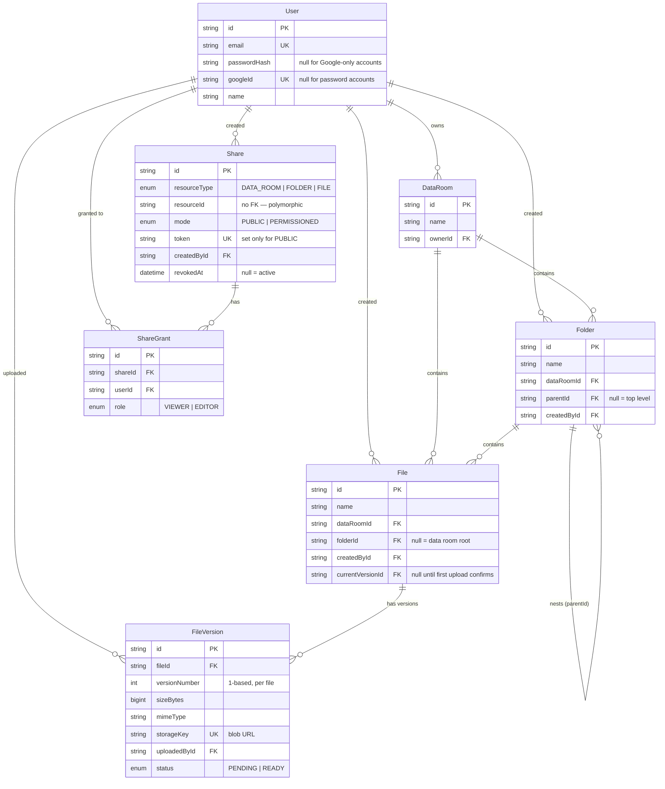

# Data Room

A virtual data room for M&A due diligence — an organised, access-controlled repository for
storing and distributing documents, in the spirit of Google Drive or Dropbox, where a Data
Room is the top-level drive.

**Live:**

| | URL |
|---|---|
| Frontend | https://data-room-azure.vercel.app |
| Backend | https://data-room-production-cda0.up.railway.app |

---

## Features

**Auth** — email/password (bcrypt) and Google Sign-In, both issuing the same JWT. A Data Room
belongs to its owner and is invisible to everyone else unless shared.

**Folders** — create, nest arbitrarily deep, rename, browse with breadcrumb navigation, and
delete with a warning that spells out exactly how many subfolders and files will go with it.

**Files** — multi-file upload with drag-and-drop and per-file progress, in-app PDF viewing with
page navigation, rename with conflict detection, move between folders, delete.

**Search** — find a file by name across an entire Data Room, not just the open folder. Each
result shows the folder path it lives in, and clicking that path jumps straight there.

**Versioning** — uploading a file whose name already exists in that folder adds a version
instead of a renamed copy. Listings, search and share links always resolve to the current
version; the owner can open the full history and view any earlier revision.

**Sharing** — share a Data Room, a folder, or a single file. Two modes: a public link that
anyone can open without an account, and a permissioned share granted to specific registered
users. Access cascades: sharing a Data Room or folder shares everything nested inside it. The
owner can revoke either at any time.

---

## Tech stack

| Layer | Choice |
|---|---|
| Frontend | React 19, TypeScript, Vite, Tailwind v4, shadcn/ui, react-pdf |
| Backend | NestJS 11, Prisma 6, PostgreSQL |
| File storage | Vercel Blob (private access) |
| Hosting | Vercel (frontend), Railway (API + Postgres) |

The repo is a monorepo of two independent packages — `apps/api` and `apps/web` — each with its
own `package.json` and lockfile. There is no workspace tooling on purpose: the two deploy to
different platforms and share no code, so a shared root would only add indirection.

---

## Setup

### Prerequisites

- Node.js 20+
- pnpm
- A PostgreSQL database
- A Vercel Blob store (free tier is enough)
- A Google OAuth client ID, if you want the Google button to work

### Backend

```bash
cd apps/api
pnpm install                 # postinstall runs `prisma generate`
cp .env.example .env         # then fill in the values — see the comments in the file
pnpm prisma migrate deploy   # apply migrations to your database
pnpm start:dev               # http://localhost:3000
```

`JWT_SECRET` and `WEB_ORIGIN` are mandatory — the API deliberately refuses to boot without
back to a default. Generate one with `openssl rand -hex 32`.

### Frontend

```bash
cd apps/web
pnpm install
cp .env.example .env.local   # VITE_API_URL should point at the API above
pnpm dev                     # http://localhost:5173
```

### A note on uploads in local development

Uploads go straight from the browser to Vercel Blob; the API only issues a scoped upload token
and then waits for Vercel to call back and confirm. That callback cannot reach `localhost`, so
locally a file uploads successfully but its row stays `PENDING` and never appears in the
listing. This is expected — the full flow works on any publicly reachable deployment. See
`VERCEL_BLOB_CALLBACK_URL` in `apps/api/.env.example` for the related gotcha.

---

## Design decisions

**Two-phase client upload.** Files never pass through the API. The browser requests a scoped,
single-use token, uploads directly to blob storage, and Vercel then calls the API back to
confirm. The API records the file as `PENDING` up front and flips it to `READY` only on that
callback, so a half-finished upload can never show up as a real file. The upload route is the
one endpoint not behind the auth guard, because the same URL also receives Vercel's callback,
which carries no JWT — that request is verified by the SDK against the blob token instead, and
the user's own request is authenticated by hand inside the handler.

**Private blobs, proxied reads.** Stored files are private, so a stored URL is not directly
fetchable. Viewing streams the file through the API behind the normal auth check rather than
handing out a signed URL, which keeps revocation instant — pull the share and the next request
fails, with no pre-signed URL still floating around.

**Adjacency list for the folder tree.** `Folder.parentId` is a self-relation. Moves are a single
column update, and depth is unbounded. The cost lands on subtree reads, which is addressed with
a recursive CTE — see *How it scales* below.

**Polymorphic Share.** One `Share` row points at a Data Room, folder, or file via
`resourceType` + `resourceId`, instead of three nullable foreign keys or three separate tables.
Access resolution is then one uniform walk up the ancestor chain regardless of what was shared.
The trade-off is that Postgres cannot enforce the reference, so the service layer validates that
the target exists and is owned by the sharer.

**Read-only sharing.** The spec calls for recipients to get read access, so view endpoints accept
either ownership or a share, while every write endpoint stays strictly owner-only. The two paths
are separate helpers in each service (`getOwned*` vs `getAccessible*`) so that "can write" is
never accidentally satisfied by a share.

**404 instead of 403.** Requesting something you do not have access to returns *not found*,
whether it truly does not exist or simply is not yours. A 403 would confirm the resource exists,
which leaks information across tenants.

**Name conflicts, resolved differently by context.** Uploading over an existing name adds a
version to that document rather than creating `Report (1).pdf` beside it — in due diligence, the
second upload of a file almost always *is* a newer draft of the same document, and silently
renaming it hides that. Explicitly renaming a single file still rejects with a 409 and a clear
message, because there the user is right there and should decide. Uniqueness is enforced in the database, not just in application
code — including a hand-written partial index for root-level items, since Postgres treats
`NULL` parents as always distinct and the plain unique constraint would not catch duplicates
there.

**Pinned to Prisma 6.** Prisma 7's client generator emits `import.meta.url`, which breaks under
NestJS's CommonJS build. Documented inline in `schema.prisma` so nobody "helpfully" upgrades it.

---

## Data model



Constraints and indexes worth calling out:

- `Folder`: unique on `(dataRoomId, parentId, name)`, indexed on `(dataRoomId, parentId)`
- `File`: unique on `(dataRoomId, folderId, name)`, indexed on `(dataRoomId, folderId)`
- Partial unique indexes cover root-level names, where `parentId` / `folderId` is `NULL` and the
  ordinary unique constraint does not apply (migration `20260819130000_root_level_unique_names`)
- `Share`: indexed on `(resourceType, resourceId)` — the lookup access resolution performs
- Deleting a Data Room or folder cascades to everything beneath it
- Revoking is a soft delete (`revokedAt`), so links stop working without erasing the audit trail

---

## How it scales

### Computing total size and item count of a folder, including its whole subtree

A single recursive CTE, in `FoldersService.getSubtreeSummary`:

```sql
WITH RECURSIVE subtree AS (
  SELECT id FROM folders WHERE id = $1
  UNION ALL
  SELECT f.id FROM folders f INNER JOIN subtree s ON f."parentId" = s.id
)
SELECT
  (SELECT COUNT(*)::int FROM subtree) - 1                    AS "subfolderCount",
  (SELECT COUNT(*)::int FROM files
     WHERE "folderId" IN (SELECT id FROM subtree))           AS "fileCount",
  (SELECT COALESCE(SUM("sizeBytes"), 0)::bigint FROM files
     WHERE "folderId" IN (SELECT id FROM subtree))           AS "totalSizeBytes"
```

One round trip regardless of depth, rather than walking the adjacency list N times from the
application. This is the deliberate trade-off of storing the tree as an adjacency list: writes
stay trivial (a move is one `UPDATE`), and the cost is pushed onto subtree reads.

It holds up because the query is only used where a user explicitly asks — the delete
confirmation. It would stop holding up if subtree totals were shown on every row of every
listing, since cost grows with the size of the subtree, not the size of the answer.

Two ways out, in increasing order of effort:

1. **Denormalised counters** on `Folder` (`fileCount`, `totalSizeBytes`), maintained on write or
   by trigger, and rolled up to ancestors. Reads become a single row lookup; writes get more
   expensive and need care to stay consistent.
2. **A closure table** (`ancestor_id`, `descendant_id`, `depth`) — every ancestor/descendant pair
   materialised. Subtree queries become a plain indexed join with no recursion, at the cost of
   rewriting many rows on every move. Worth it when the tree is read far more than it is
   reshaped, which is exactly the profile of a real data room during diligence.

### When one Data Room holds 100,000 files

**Listing is the first thing to break.** `getContents` currently returns every folder and file
under a node with no limit. That is fine for a handful and unusable for a hundred thousand — a
huge payload, a slow query, and a browser asked to render 100k rows.

The fix is keyset (cursor) pagination rather than `OFFSET`, since `OFFSET 90000` still makes
Postgres walk 90,000 rows. Ordering by `(name, id)` and passing the last row's values as the
cursor keeps every page the same cost:

```sql
WHERE "dataRoomId" = $1 AND "folderId" = $2 AND (name, id) > ($3, $4)
ORDER BY name, id
LIMIT 50
```

**Indexes would need to cover the sort, not just the filter.** The existing
`(dataRoomId, folderId)` index answers the `WHERE` but leaves Postgres sorting the matches. It
would become `(dataRoomId, folderId, name, id)` so that the index order *is* the output order
and pagination is a range scan. Since listings only ever show `READY` files, a partial index
with `WHERE status = 'READY'` keeps half-finished uploads out of the index entirely.

**The response should get narrower too** — listings select whole rows today, including
`storageKey`, which the list view never uses.

**Search is the clearest example of a deliberate trade-off.** It is implemented as a
case-insensitive `ILIKE '%query%'` across the data room, capped at 50 rows. A leading wildcard
cannot use a B-tree index, so this is a sequential scan over the room's files — which is the
right call at a few hundred or few thousand files, and buys the feature without a migration.
At the scale above it becomes the bottleneck, and the fix is a `pg_trgm` GIN index on `name`,
which *can* serve a leading wildcard. Beyond that — searching document contents rather than
file names — the answer stops being an index and becomes a separate full-text store fed by the
upload pipeline.

**The subtree CTE becomes the next bottleneck**, which is the point where the denormalised
counters described above stop being optional.

Everything else scales flat: access resolution walks the ancestor chain, whose length is tree
depth, not file count.

### Extending sharing to per-user roles (viewer/editor)

The schema already carries it: `ShareGrant.role` is a `ShareRole` enum of `VIEWER | EDITOR`,
defaulting to `VIEWER`. It is stored but not yet enforced, because the spec asks for recipients
to get read-only access. Turning it on requires no migration.

What would change is the authorisation layer, and it is deliberately confined to one place.
`ShareAccessService.canRead` is the single function that resolves whether a user may read a
resource; it would gain a `canWrite` sibling that walks the same ancestor chain and additionally
requires `role = 'EDITOR'`. Write endpoints, which today call the strict owner-only helpers,
would move to that check. Nothing else in the codebase asks "who may touch this".

The genuinely new decision is precedence, and it is a policy question rather than a modelling
one: when a user holds `VIEWER` on a Data Room and `EDITOR` on a folder inside it, does the
most-specific grant win or the highest-privilege one? Both are defensible; it needs to be picked
and documented, since the chain walk currently stops at the first active share it finds.

Public links stay read-only regardless — there is no identity to attach a role to.

---

## How AI was used

This project was built in a pair-programming loop with Claude Code, Anthropic's CLI. Roughly how
the work split:

**Written mostly by AI:** the bulk of the implementation once a decision was made — NestJS
modules following the pattern of the first one, React components against agreed designs, DTOs,
migrations, config, and the mechanical parts of refactors.

**Decided by me:** the data model, the sharing and access-resolution semantics, every
architectural trade-off recorded in this README, and what was in or out of scope. Nothing landed
without me reading the diff; every commit was reviewed and explicitly approved.

**Where AI was most useful:** root-causing bugs by gathering evidence instead of guessing.
Several non-obvious problems were found this way — reading the compiled Prisma output to prove
the Prisma 7 CJS incompatibility, reading the `@vercel/blob` source to discover that the upload
callback URL is silently skipped off-Vercel (which had left every upload stuck in `PENDING`),
and tracing a 500 to Express refusing to serialise Prisma's `BigInt` file sizes.

**Where I had to push back:** scope. Working from a richer reference design, the obvious
temptation was to build toward things the app does not actually do — audit trails, link expiry,
file versioning. Those were deliberately left out, since the brief asks not to ship
unimplemented features.

---

## Not implemented

Called out explicitly, since the brief asks for a design without unimplemented features on show:

- **`EDITOR` role enforcement** — modelled, not wired up; sharing is read-only by design
- **A "shared with me" listing** — recipients reach shared items by link; shares do not surface
  in their own Data Rooms list
- **Blob cleanup on cascade delete** — deleting a single file removes its blob, but deleting a
  folder or Data Room relies on the database cascade and leaves the underlying blobs in storage
